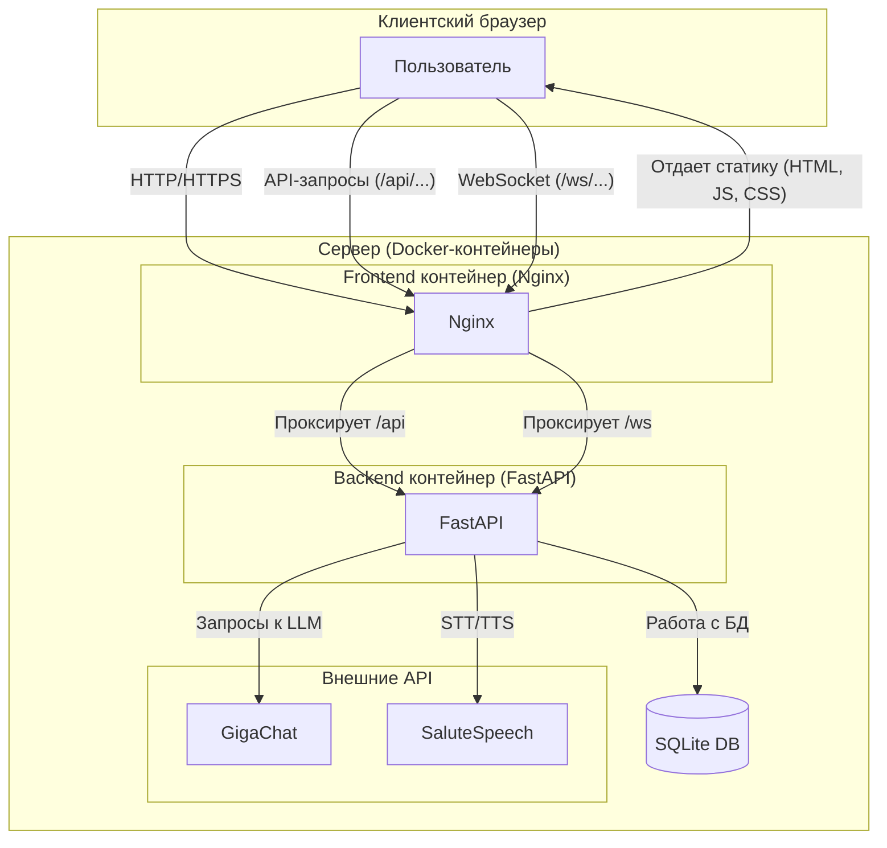

# Архитектура проекта AI Assistant

Этот документ подробно описывает архитектуру клиент-серверного приложения AI Assistant, его компоненты, их взаимодействие и назначение каждого файла в проекте.

## 1. Обзор высокого уровня

Проект построен по **микросервисной архитектуре**, разделенной на три ключевых компонента, которые упакованы для развертывания с помощью Docker:

1.  **Бэкенд (Backend)**: Сердце приложения, написанное на Python с использованием фреймворка **FastAPI**. Этот сервис обрабатывает всю бизнес-логику.
2.  **Фронтенд (Frontend)**: Пользовательский интерфейс, созданный как одностраничное приложение (SPA) на **React**. Он полностью отвечает за взаимодействие с пользователем.
3.  **Веб-сервер/Прокси (Nginx)**: Используется для обслуживания статических файлов фронтенда и как **обратный прокси (reverse proxy)** для маршрутизации запросов к бэкенду.

### Схема взаимодействия компонентов

---

## 2. Подробное описание компонентов

### 2.1. Бэкенд (Backend)

*   **Технологии**: Python, FastAPI, SQLAlchemy, Uvicorn.
*   **Ответственность**: Обеспечение API для фронтенда, управление логикой, работа с данными и интеграция с внешними сервисами.

#### Структура директории `app`

*   `main.py`: **Точка входа** в приложение.
    *   **Инициализация FastAPI**: `app = FastAPI()` создает экземпляр приложения.
    *   **CORS (Cross-Origin Resource Sharing)**: `app.add_middleware(CORSMiddleware, ...)` — критически важная настройка, которая позволяет браузеру (фронтенду), загруженному с одного домена (например, `localhost:3000`), безопасно отправлять запросы на бэкенд, работающий на другом домене (`localhost:8080`).
    *   **Подключение маршрутизаторов**: `app.include_router(...)` — регистрирует эндпоинты из файлов в директории `routers`. Это позволяет разделять логику на модули (аутентификация, чат, голос).
    *   **События жизненного цикла**: `@app.on_event("startup")` — декоратор, который выполняет код (в нашем случае `create_tables()`) один раз при запуске сервера.
    *   **Запуск для разработки**: `uvicorn.run(...)` запускает ASGI-сервер `Uvicorn`, который обслуживает наше FastAPI приложение. `reload=True` автоматически перезапускает сервер при изменениях в коде.

#### `app/routers/` - Контроллеры API

Это файлы, которые определяют конкретные "ручки" (эндпоинты) API.

*   `auth.py`: Управляет аутентификацией.
    *   **/register**: Принимает данные нового пользователя, хеширует пароль (никогда не храните пароли в открытом виде!) и сохраняет в БД.
    *   **/login**: Проверяет учетные данные. Если они верны, создает и возвращает **JWT (JSON Web Token)**. Этот токен — зашифрованная строка, которая служит "пропуском" для пользователя на защищенные эндпоинты.

*   `chat.py`: Логика чата.
    *   **/chat/history**: Защищенный эндпоинт. Он берет токен из заголовков запроса, определяет пользователя и возвращает его историю сообщений из БД.
    *   **/ws/{user_id}**: Эндпоинт **WebSocket**. В отличие от HTTP, он создает постоянное двустороннее соединение между клиентом и сервером.
        *   `ConnectionManager`: Вспомогательный класс для отслеживания всех активных подключений.
        *   **Цикл работы**: После установки соединения сервер "слушает" сообщения от клиента. При получении сообщения он передает его в AI-агент, а ответ от агента отправляет обратно клиенту через то же соединение. Это позволяет получать ответы от ассистента без необходимости постоянно обновлять страницу.

*   `voice.py`: Обработка голоса.
    *   **/voice/stt** (Speech-to-Text): Получает аудиофайл (в формате `.webm`, который стандартно записывает браузер), с помощью библиотеки **ffmpeg** конвертирует его в формат `.wav` (который понимает API Сбера), отправляет на распознавание и возвращает текст.
    *   **/voice/tts** (Text-to-Speech): Принимает текст, отправляет его в API синтеза речи и возвращает аудиопоток, который фронтенд может воспроизвести.

#### `app/database/` - Слой данных

*   `models.py`: Определяет структуру таблиц БД с помощью **SQLAlchemy ORM**. Классы здесь (например, `User`) сопоставляются с таблицами. ORM позволяет работать с БД, используя Python-объекты, а не писать SQL-запросы вручную.
*   `init_db.py`: Функция для инициализации схемы БД.
*   `session.py` (или аналогичный): Управляет сессиями подключения к БД.

#### `app/schemas/` - Схемы данных (Pydantic)

*   **Назначение**: Определяют, как выглядят данные, которыми обмениваются клиент и сервер.
*   **Преимущества**:
    1.  **Валидация**: FastAPI автоматически проверяет, соответствуют ли входящие запросы этим схемам. Если нет — возвращает осмысленную ошибку.
    2.  **Сериализация**: Автоматически преобразует данные из Python-объектов в JSON для отправки клиенту.
    3.  **Документация**: На основе этих схем FastAPI генерирует интерактивную документацию API (Swagger UI), доступную по адресу `/docs`.

### 2.2. AI Агент (`agent`)

*   **Технологии**: LangChain.
*   **Ответственность**: Интеллектуальная обработка запросов пользователя. LangChain — это фреймворк, который упрощает создание приложений на основе больших языковых моделей (LLM).
*   **Ключевые концепции**:
    *   **LLM Wrapper**: Обертка для GigaChat, унифицирующая интерфейс взаимодействия с моделью.
    *   **Tools (Инструменты)**: Функции, которые агент может вызывать. Например, поиск в интернете, калькулятор, запрос к базе данных. Агент сам решает, когда использовать инструмент.
    *   **Prompt Templates**: Шаблоны для формирования запросов к LLM. Они помогают "направить" модель на правильный ответ, добавляя контекст и инструкции.
    *   **Agent Executor**: Ядро агента. Он получает запрос, решает, какой инструмент (если нужен) использовать, вызывает его, получает результат и на основе этого формирует финальный ответ.

### 2.3. Фронтенд (Frontend)

*   **Технологии**: React, Axios, Styled-components.
*   **Ответственность**: Пользовательский интерфейс (UI) и взаимодействие с пользователем (UX).

#### Структура директории `client/src`

*   `index.js` & `App.js`: Точка входа. `index.js` монтирует главный компонент `App.js` в `public/index.html`. `App.js` управляет роутингом (какую страницу показывать).
*   `api/`: Модуль для общения с бэкендом. Содержит функции (например, `login(user, pass)`), которые инкапсулируют логику HTTP-запросов с помощью библиотеки **Axios**.
*   `components/`: **Переиспользуемые UI-элементы**. Это "атомы" интерфейса: `Button`, `Input`, `Avatar`.
*   `pages/`: **Компоненты-страницы**. Собирают мелкие компоненты в полноценные экраны: `LoginPage`, `ChatPage`.
*   `context/`: **Глобальное состояние**. React Context API используется для хранения данных, которые нужны многим компонентам (например, информация об авторизованном пользователе), чтобы не "прокидывать" их вручную через всю иерархию компонентов.

### 2.4. Контейнеризация и Деплой

*   `Dockerfile`: Инструкция по сборке образа для бэкенда. Устанавливает Python, `ffmpeg`, зависимости из `requirements.txt` и копирует код.
*   `Dockerfile.client`: Использует **многоэтапную сборку (multi-stage build)**.
    1.  **Этап `build`**: Устанавливает Node.js, скачивает зависимости (`npm install`) и собирает React-приложение (`npm run build`). Результат — папка `build` с оптимизированными статическими файлами (HTML, CSS, JS).
    2.  **Финальный этап**: Берется легковесный образ `nginx` и в него копируется только папка `build` из предыдущего этапа. Это делает финальный образ очень маленьким и безопасным.
*   `nginx.conf`: Конфигурация Nginx.
    *   `listen 80`: Слушает стандартный HTTP-порт.
    *   `location /`: Обслуживает статические файлы фронтенда. `try_files` — ключевая директива для SPA, которая перенаправляет все запросы на `index.html`, позволяя React-роутеру работать корректно.
    *   `location /api/` и `location /ws`: **Проксирование**. Все запросы, начинающиеся с `/api/` или `/ws`, перенаправляются на бэкенд-контейнер (`http://backend:8080`). Это скрывает реальный адрес бэкенда от пользователя и решает проблему CORS на уровне инфраструктуры.
*   `docker-compose.yml`: "Оркестратор" для всего приложения.
    *   Описывает два **сервиса**: `backend` и `frontend`.
    *   `build`: Указывает, где найти Dockerfile для каждого сервиса.
    *   `ports`: "Пробрасывает" порты из контейнера наружу (например, порт 80 контейнера `frontend` становится доступен как порт 80 на хост-машине).
    *   `environment`: Передает переменные окружения (секреты) в контейнер `backend` из файла `.env`.
    *   `depends_on`: Гарантирует, что `frontend` будет запущен только после `backend`.

---

## 3. Файлы в корневой директории

*   `README.md`: Инструкция по установке, запуску и деплою проекта.
*   `requirements.txt`: Список Python-зависимостей.
*   `package.json`: Список JavaScript-зависимостей и скрипты для сборки/запуска фронтенда.
*   `.env` / `example_dotenv`: Хранение секретных ключей и конфигурации. `.env` должен быть в `.gitignore`.
*   `.dockerignore`: Аналог `.gitignore` для Docker. Указывает, какие файлы не нужно копировать в образ при сборке (например, `node_modules`, `venv`), чтобы ускорить сборку и уменьшить размер образа.
*   `deploy.sh`: Скрипт для автоматизации развертывания, который выполняет шаги, описанные в README. 